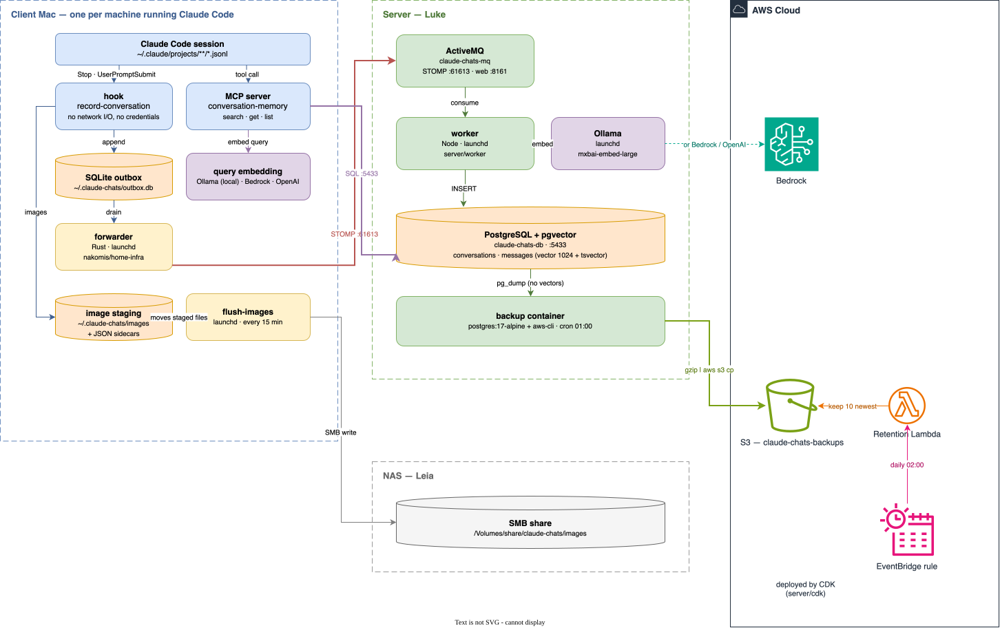

# claude-chats

Records Claude Code conversations to PostgreSQL with vector embeddings for semantic search, exposed via an MCP server.

A hook fires on every user message and again at session end, capturing new messages. Each message is embedded so the MCP tools can do similarity search across every conversation you have ever had with Claude — across every machine you have them on.

## Standalone

Looking for the standalone installer README.md? [Click here](localhost/README.md).

That edition runs everything on one machine — no server, no broker, no cloud account — and is the one to use if you just want this on your laptop. Everything below describes the distributed system.

## Support

If you find this useful, please consider buying me a coffee:

[](https://www.paypal.com/donate?hosted_button_id=Q3BESC73EWVNN&custom=claude-chats)

## How it works

Several client machines record into one shared database at home. Capture and delivery are deliberately split, and **every hop is outbound** — the home network accepts no inbound connections at all.



*Source: [`docs/architecture/distributed-architecture.drawio`](docs/architecture/distributed-architecture.drawio). The SVG is regenerated on commit by `githooks/pre-commit` — enable it with `git config core.hooksPath githooks`.*

### Capture — on each client (this repository)

The hook (`hook/hook/record.py`) fires on `Stop` and `UserPromptSubmit`. It reads the session transcript, works out which messages are new, and **appends them to a local SQLite outbox**. That is all it does: no network I/O, no credentials, no daemon, nothing that can be "down".

It used to write straight to Postgres, and it failed silently — when the Docker daemon holding the database was down, the write threw and the message vanished with no signal at all. Pointing it at a database on another host would have made that worse, not better: more failure modes (network, credentials, being away from home), not fewer. So capture and delivery were split, and only capture has to be reliable. If SQLite itself is unavailable, the hook falls back to an append-only NDJSON file rather than swallowing the error.

Deduplication happens locally, because the hook re-reads the whole transcript on every `Stop` and can no longer ask Postgres what it has already seen. `INSERT OR IGNORE` against a `UNIQUE message_uuid` does it — which is why delivered rows are kept as tombstones rather than deleted.

### Delivery — the ingest hop (lives in `home-infra`)

This half is **not in this repository**. It lives in [`nakomis/home-infra`](https://github.com/nakomis/home-infra), whose `docs/architecture/conversation-memory.drawio` is the authoritative topology; the diagram above shows only enough of it to make sense of the ends.

A **Rust forwarder** (`mac/conversation-memory-forwarder`) runs on each Mac, drains the outbox and posts each message to an **SQS** queue, age-encrypted to the consumer's public key. Payloads over 200 KB go to an **S3 claim-check bucket** instead, with the message carrying the reference. It authenticates with **IAM Roles Anywhere** — an mTLS certificate from the home CA, pinned by CN per machine — so there are no static access keys, and its role is send-only: it cannot read back what it enqueued. It holds no database connection at all, which is precisely what keeps Postgres off the internet.

An **embedding-consumer** on Cal polls the queue, decrypts, embeds via its local Ollama, and upserts into Luke's Postgres. It deletes the message only after the commit, so an at-least-once redelivery rewrites identical rows rather than losing one. Repeated failures land in a **DLQ**.

That shape is what makes the roaming case work: an expired credential, or a train with no signal, becomes a *delay* rather than a lost message.

### Storage and recall

**PostgreSQL + pgvector** on Luke holds `conversations` and `messages`, the latter carrying both a `vector(1024)` embedding (ivfflat, cosine) and a generated `tsvector` (GIN). The `host` column records which machine a conversation happened on, so search can span every machine or filter to one. It is reachable only on the LAN.

The **MCP server** (`mcp/`) runs on the client and queries that Postgres **directly**, embedding only the search query locally — which is why a client still needs an embedding provider configured even though it never embeds a message. Recall therefore works on the LAN, not while roaming.

The home portal's web UI takes a different route: it calls a `POST /search` endpoint on Cal's consumer, gated by both mTLS and a Cognito token, since that endpoint can read the full text of every session on the estate.

### Images

Images pasted into Claude live in the transcript as base64 and nowhere else that lasts. The hook stages them to a local directory with a JSON sidecar recording every id, and a `flush-images` LaunchAgent moves them to an SMB share every 15 minutes. The same split again: staging is local and cannot fail; the share is over two wireless hops and is allowed to.

### About `server/`

The `server/` directory — the ActiveMQ container, the Node STOMP worker, `server/install.sh` and the S3 backup CDK stack — is the **previous** client-server design, superseded by the SQS ingest hop above. It is kept for reference and is not what runs. The same goes for `install-client.sh`'s `CLAUDE_CHATS_MODE=remote` and `CLAUDE_CHATS_QUEUE_URL`: the current `record.py` reads neither, and always writes to the outbox.

## Repository layout

| Path | What |
|---|---|
| `hook/` | The capture hook, embedding helper, backfill and image archiving |
| `mcp/` | The MCP server — hybrid search, transcript retrieval, session listing |
| `init.sql` | Source of truth for the Postgres schema |
| `scripts/` | Backup/restore, LaunchAgent setup, embedding evaluation harnesses |
| `localhost/` | The self-contained [single-machine edition](localhost/README.md) |
| `docs/architecture/` | The diagram above, as `.drawio` source and exported SVG |
| `server/` | **Superseded** — the previous ActiveMQ/worker design, kept for reference |

## Installation

The distributed system is installed from two repositories, because it is built from two.

**From [`nakomis/home-infra`](https://github.com/nakomis/home-infra):** the ingest hop — the `ConversationMemoryIngestStack` (SQS queue, DLQ, S3 claim-check bucket, IAM Roles Anywhere trust anchor), the forwarder on each Mac, and the embedding-consumer on Cal. Its `docs/runbooks/conversation-memory-ingest-bootstrap.md` is the procedure, including issuing the two client certificates. Configuration for both ends is published under `/conversation-memory/<env>/` in SSM so they cannot drift apart.

**From here:** the hook and the MCP server on each client.

```bash
SERVER_HOST=luke.local ./install-client.sh
```

That installs the dependencies, registers the MCP server against Luke's Postgres, and configures the `Stop` and `UserPromptSubmit` hooks. Re-running is safe — every step is idempotent.

Without the forwarder from `home-infra`, the outbox fills and nothing drains it — this repository is capture and recall, not delivery. If you want something that works end to end from a single checkout, use the [single-machine edition](localhost/README.md).

### Prerequisites

**Each client:** [uv](https://docs.astral.sh/uv/), [Claude Code](https://claude.com/claude-code), Python 3.11+, and one of Ollama (local), AWS credentials (Bedrock) or an OpenAI API key — used only to embed search queries. No Docker: nothing runs in a container on the client.

**The database host:** Docker, for Postgres + pgvector.

**The consumer host:** Docker and Ollama. See `home-infra`.

## Embedding providers

Configured independently on the server (for message embedding) and on each client (for query embedding). They must agree: a query embedded with one model will not match messages embedded with another.

| Provider | Default model | Notes |
|---|---|---|
| `ollama` | `mxbai-embed-large` | Local; no data leaves the machine. 512-token context — input is truncated to ~800 chars. |
| `bedrock` | `amazon.titan-embed-text-v2:0` | Also supports `cohere.embed-english-v3`. Requires AWS credentials. |
| `openai` | `text-embedding-3-small` | Requires `OPENAI_API_KEY`. Supports up to 8 192 chars. |

Override the model or output dimensions:

```bash
CLAUDE_CHATS_MODEL=mxbai-embed-large \
CLAUDE_CHATS_DIMENSIONS=1024 \
CLAUDE_CHATS_PROVIDER=ollama \
./install-client.sh
```

`init.sql` declares `vector(1024)`, so a provider with a different output width needs `CLAUDE_CHATS_DIMENSIONS` set to something it supports, or a schema change.

## MCP tools

Once installed, three tools are available inside Claude Code:

| Tool | Description |
|---|---|
| `search_memory` | Hybrid semantic + full-text search across all recorded messages, fused with Reciprocal Rank Fusion. Returns the most relevant excerpts with surrounding context. Also accepts `mode` (`hybrid` / `semantic` / `fulltext`). |
| `get_conversation` | Fetch the full transcript for a session by ID. Supports pagination via `start_seq` / `end_seq`. |
| `list_recent_sessions` | List recent sessions, newest first. Optionally filter by project path. |

## Database

PostgreSQL + pgvector runs in Docker on Luke, published on port 5433 and reachable only on the LAN — it is never exposed to the internet, which is the constraint the whole ingest design is built around.

```bash
# From anywhere on the home network
psql -h luke.local -p 5433 -U claude claude_chats
```

`init.sql` is the source of truth for the schema. It is vendored into `home-infra` for the deployed copy, and `tests/test_pg_schema.py` pins a checksum of the DDL so the two cannot silently drift.

Backups are handled in `home-infra` alongside the rest of the estate. `scripts/backup.sh` and `scripts/restore.sh` here belong to the superseded `server/` stack.

## Possible future enhancements

### HyDE (Hypothetical Document Embeddings)

Rather than embedding the raw search query, use a local LLM to generate a *hypothetical* conversation excerpt that would answer the query, then embed that instead. Documents and hypothetical documents occupy similar regions of the embedding space, so this can improve recall significantly — especially for short or abstract queries.

`llama3.2:3b` is a good fit for this: small enough to respond in under a second on a laptop, but capable enough to produce a plausible short excerpt.

```bash
ollama pull llama3.2:3b
```

Note: HyDE is most beneficial when using a model with a long context window. With the current `mxbai-embed-large` setup (512-token / ~800 char limit), a generated excerpt would be truncated heavily. Switching to a model like `nomic-embed-text` (8 192 tokens) first would make HyDE considerably more effective.

### Longer-context embedding model

`nomic-embed-text` supports 8 192 tokens and is available locally via Ollama. Switching to it would allow full messages to be embedded rather than truncated, at the cost of re-embedding all existing messages (dimensions change from 1 024 to 768).

```bash
ollama pull nomic-embed-text
```

## Support

If you find this useful, please consider buying me a coffee:

[](https://www.paypal.com/donate?hosted_button_id=Q3BESC73EWVNN&custom=claude-chats)
