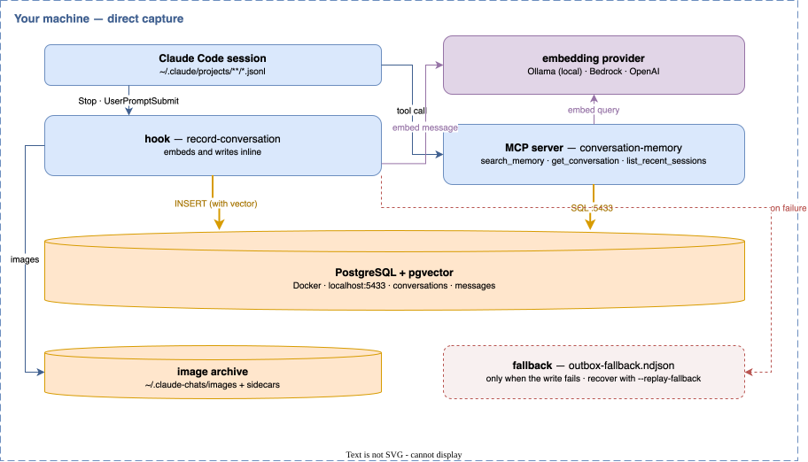
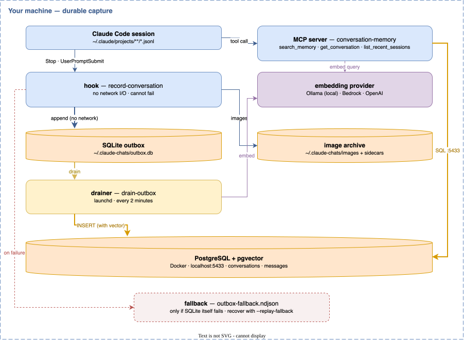

# claude-chats — single-machine edition

Records your Claude Code conversations to a local PostgreSQL with vector
embeddings, and exposes them to Claude through an MCP server so it can search
everything you have ever discussed.

Everything runs on one machine. There is no server to build, no message broker,
no cloud account and no second host. If you want the distributed version — where
several machines share one database behind a queue — see the [repository
root](../README.md).

## Support

If you find this useful, please consider buying me a coffee:

[](https://www.paypal.com/donate?hosted_button_id=Q3BESC73EWVNN&custom=claude-chats)

## Install

```bash
cd localhost
./install.sh
```

It asks which capture mode you want, then does the rest. Full details, including
the maintenance commands, are in **[INSTALL.md](INSTALL.md)**.

## How it works

A hook fires on every user message and again at session end. It reads the
session transcript, works out which messages are new, and records them. The MCP
server then searches them — semantically, by full text, or both.

There are two ways the recording half can work, chosen at install time.

### direct

The hook does everything inline: embed, then write.



Simplest, and a message is searchable the moment the session stops. The cost is that capture now depends on Docker, Postgres and the embedding provider all being up. When one of them is not, the message goes to an append-only fallback file and waits for `./install.sh --replay-fallback`.

### durable

Capture and delivery are split, and only capture has to be reliable.



The hook appends to a local SQLite file and does no network I/O at all, so a stopped database is a delay rather than a lost message — the outbox simply grows and drains later. The costs are one more moving part and a couple of minutes before a message becomes searchable.

This is the same split the distributed edition uses, with its forwarder, SQS queue and remote consumer collapsed into one local process.

*Diagram sources: [`docs/architecture/`](docs/architecture). The SVGs are regenerated on commit by the repository's `githooks/pre-commit`.*

## What you get

Three MCP tools, available to Claude in any project once you restart Claude Code:

| Tool | What it does |
|---|---|
| `search_memory` | Hybrid semantic + full-text search across every recorded message |
| `get_conversation` | Fetch a full transcript by session id |
| `list_recent_sessions` | Browse what has been recorded lately |

Images you paste into Claude are archived too, under `~/.claude-chats/images`,
each with a JSON sidecar recording where it came from. A search hit that mentions
an image can be resolved back to the actual picture by its sha256.
